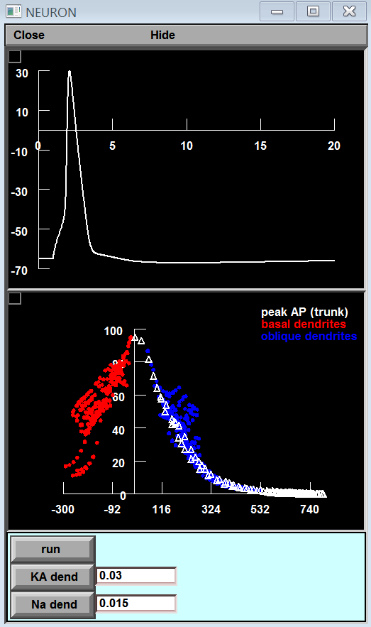
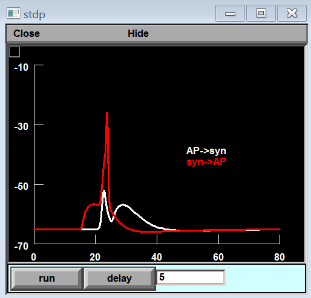

Model files for the Springer [Encyclopedia of Computational Neuroscience](http://dx.doi.org/10.1007/978-1-4614-6675-8_123) entry "Action potential Back-Propagation" by Sonia Gasparini and Michele Migliore.

The model shows how the back-propagation of action potentials  
in the dendrites of CA1 pyramidal neurons is modulated by  
active conductances and synaptic inputs.

The simulation file springer-bAP.hoc reproduces Fig.2 of the entry:

A somatic AP is first elicited with a short current pulse.  
Its peak amplitude as it backpropagates into the dendritic tree is shown in the bottom panel at the end of the simulation.  
Users can set the somatic peak conductance of the Na and KA currents to see their effect on the AP backpropagation.

springer-bAPsyn.hoc reproduces Fig.4 of the entry:

A somatic AP and a synaptic input are elicited with a relative delay. The simulation shows the local membrane potential of an oblique dendrite at about 400 um from the soma under two different conditions:

- (white) synaptic input is activated after the AP.  
- (red) synaptic input is activated before the AP.

Users can set the relative delay (in ms) to see its effect on the local membrane potential.

Under unix systems: to compile the mod files use the command `nrnivmodl` and run the simulation file with the command `nrngui filename`

Under Windows systems:  
to compile the mod files use the "mknrndll" command. A double click on a simulation file will open the simulation window. If you need more help running the model please consult this page:  
[https://senselab.med.yale.edu/ModelDB/NEURON_DwnldGuide](https://senselab.med.yale.edu/ModelDB/NEURON_DwnldGuide)

Questions on how to use this model should be directed to [michele.migliore@cnr.it](mailto:michele.migliore@cnr.it)

---

2025-07-09: Converted README to Markdown.
